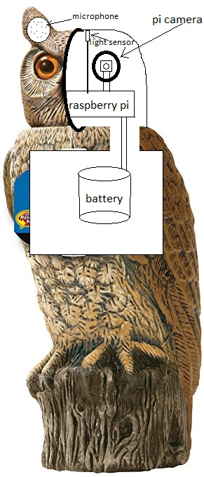
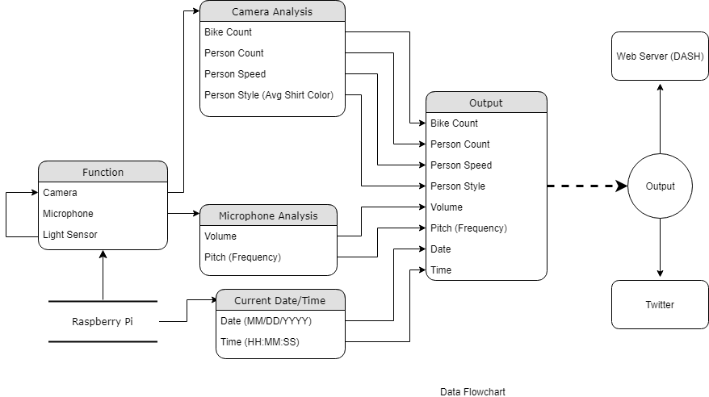
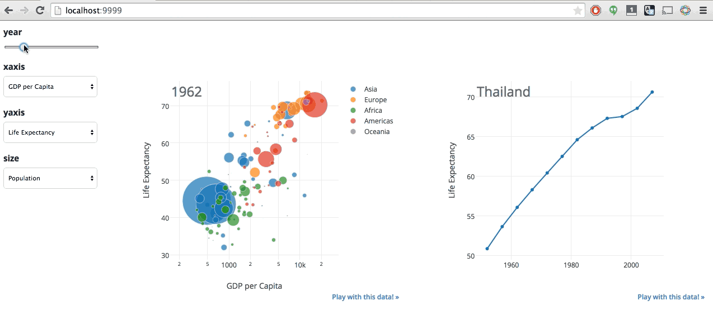
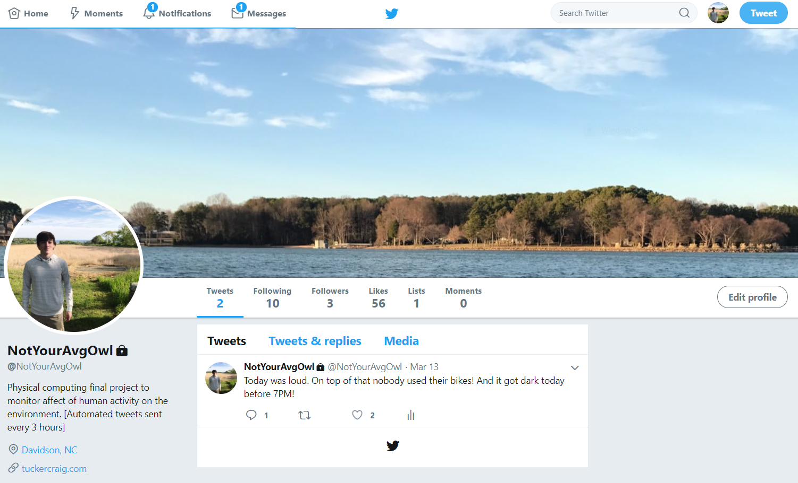

## Physical Computing Final Project
Dummy owl which will analyze pi-camera data to figure out either fashion trends, if students tend to leave for class on bike, if they leave with backpacks, etc. Birds have very advanced eyesight which is what motivates having an analyzed camera in the system. A microphone will be used to analyze overall volume of the environment. This will be used to understand how loud humans are being in the given area and the impact that humans are having on the audio-volume of a particular place. A pi LDR (light sensor) will help the owl decide when to sleep (or put only certain sensors to sleep). Tweets will be produced by the owl (lol) related to the data. These tweets will be composed of either a count of people walking/biking, average color of pedestrian's shirts for the day, average/max volume of the day, etc. There's a possibility that data will be visualized using Dash, as well, on my website. See sentdex tutorial on Dash on YouTube.

## Deployment

Python Dependencies:

- numpy
- matplotlib
- cv2 (opencv)

To download opencv on linux:

```
sudo apt-get install libopencv-dev python-opencv
```

Sensors:

- pi-camera
- microphone
- pi light sensor

Design:

{ height=300px }

Dataflow:



Potential visualization:




## Built With

* [OpenCV](https://opencv.org/) - A computer vision module for Python.
* [HaarCascades](https://github.com/opencv/opencv/tree/master/data/haarcascades) - Definition of objects to be found in video stream in conjunction with OpenCV.
* [Dummy Owl](https://www.amazon.com/gp/product/B0000AX52C/ref=s9u_wsim_gw_i1?ie=UTF8&fpl=fresh&pd_rd_i=B0000AX52C&pd_rd_r=f4a53eb7-3143-11e8-bb6d-df8617f41b33&pd_rd_w=8C0wE&pd_rd_wg=RXqoN&pf_rd_m=ATVPDKIKX0DER&pf_rd_s=&pf_rd_r=R3BY51ZJHCSKEH12TM6T&pf_rd_t=36701&pf_rd_p=e6624b56-7cc1-411f-9d12-9cc8feb6c214&pf_rd_i=desktop)

## Authors

* **Tucker Craig** - Davidson College Class of 2020 - [tucraig](https://github.com/tucraig)

See also the list of [contributors](https://github.com/tucraig/phys-comp-final/contributors) who participated in this project.

## Acknowledgments

* [prompt](https://docs.google.com/document/d/e/2PACX-1vQklaunRcSSlpSk-DiuoAwtUCr8A_91_vcj5n6xWuxzLRZ0zWeHhpuZyv9fxnLSLjG3j-L8xEPxtKOM/pub)
* sentdex on YouTube
